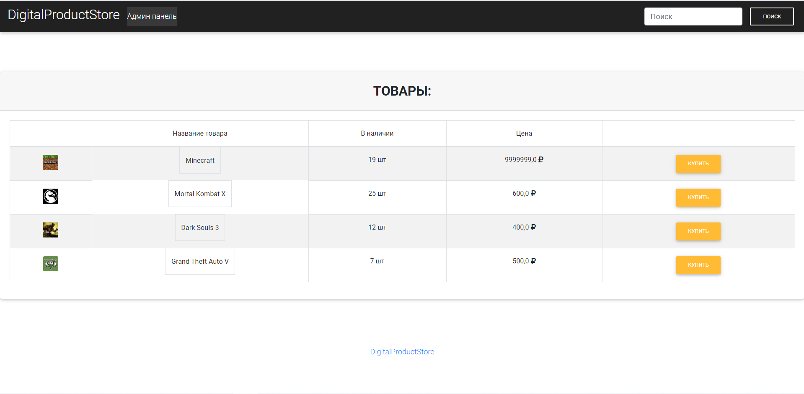
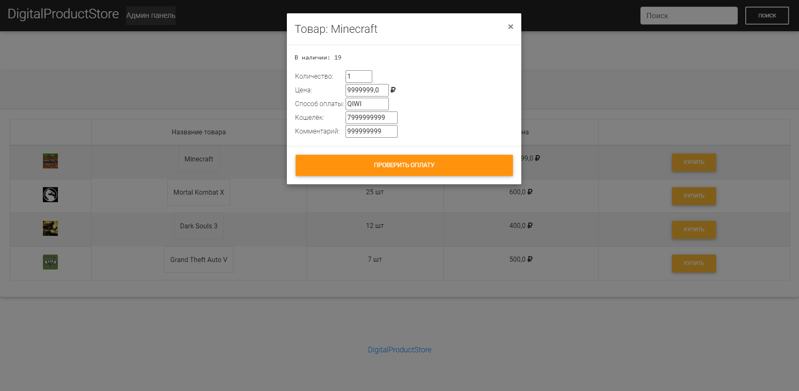
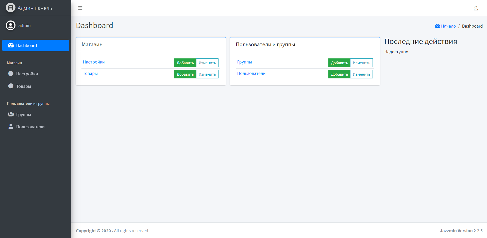

##Интернет магазин цифровых товаров на Django##
***
​
Главная страница сайта
***
​
Форма проверки оплаты
***
​
Админ панель
***
<b>Оплата принимается через QIWI кошелек.</b>
***
<h4>Установка и настройки</h4>

Выполните команду 
<pre>pip3 install -r requirements.txt</pre>
 
В самом проекте отредактируйте файл
<pre>config.py</pre>
 
Установите секретный ключь и введите данные дя подключении к базе данных.
<pre>

SECRET_KEY = 'There is a secret key'
"""SETTING MySQL"""

db_host = 'mysql server ip address'
db_login = 'mysql server login'
db_password = 'mysql server password'
db_name = 'mysql server basedata name'
</pre>

Далее нужно создать таблицы в базе данных
 
Выполняем команды которые приведены ниже
<pre>
python3 manage.py makemigrations
python3 manage.py migrate
</pre>
Затем создаём профиль для администратора
<pre>
python3 manage.py createsuperuser
</pre>

После устновки при попытке зайти на сайт вас будет перебрасывать на страницу администратора.
Вам надо будет полностью настроить сайт что бы он заработал.
